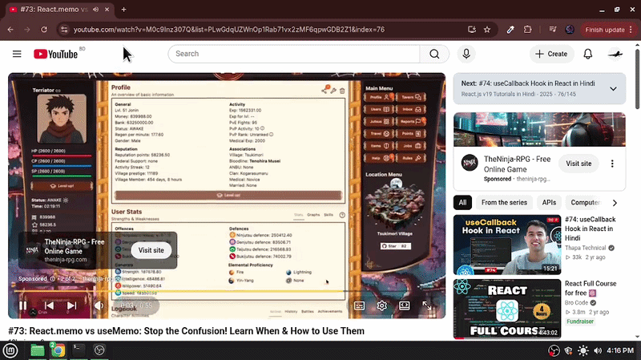

# py_adskipper ⏩🤖

A simple Python automation script that detects YouTube "Skip Ad" buttons on screen and automatically clicks them using screen-matching and GUI automation.

 

## 📌 Features

* **Automated Detection:** Continuously scans your screen for the YouTube "Skip Ad" button.
* **Image Recognition:** Uses template matching to locate `skip.png` on your display.
* **Auto-Clicking:** Moves the cursor and clicks the button as soon as it appears.

## 🛠️ Prerequisites & Installation

1. Make sure you have **Python 3.x** installed.
2. Install the required libraries:

```bash
pip install pyautogui opencv-python pillow
